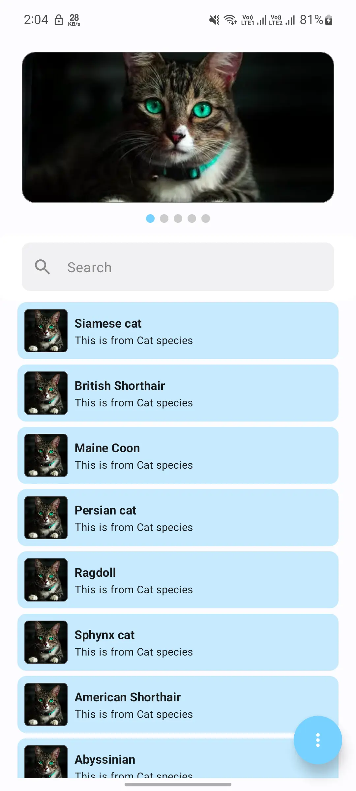
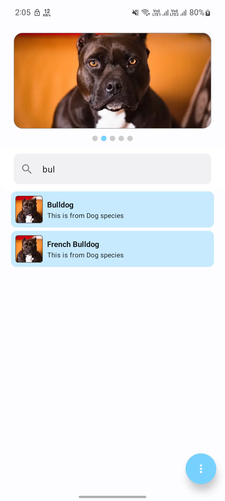
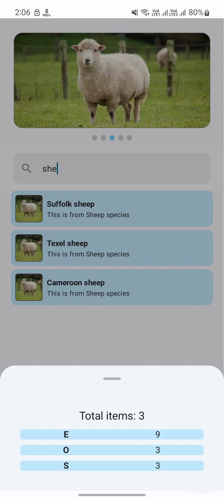
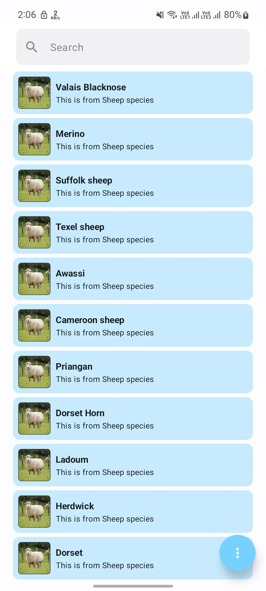

# Project - Petopedia

## Description

1. This Petopedia app displayed pet animal with their breeds
2. Architecture used: MVVM with clean
- **Model-View-ViewModel (MVVM)**
    - **Model**: Represents the data layer, including repositories, data sources, and business logic.
    - **View**: UI layer represented by Jetpack Compose and XML layouts. In case of XML used adapter binding
    - **ViewModel**: Manages UI-related data and handles business logic to interact with the model.
    - **Clean Architecture**
        - **Domain Layer**: Contains business logic and entity models.
        - **Data Layer**: Manages data sources.
        - **Presentation Layer**: Manages UI components and view models.

## Screenshots
Demonstration of the app is attached in the folder named screenshots. You can find them in the [screenshots](screenShots) directory.

Screen shots:

